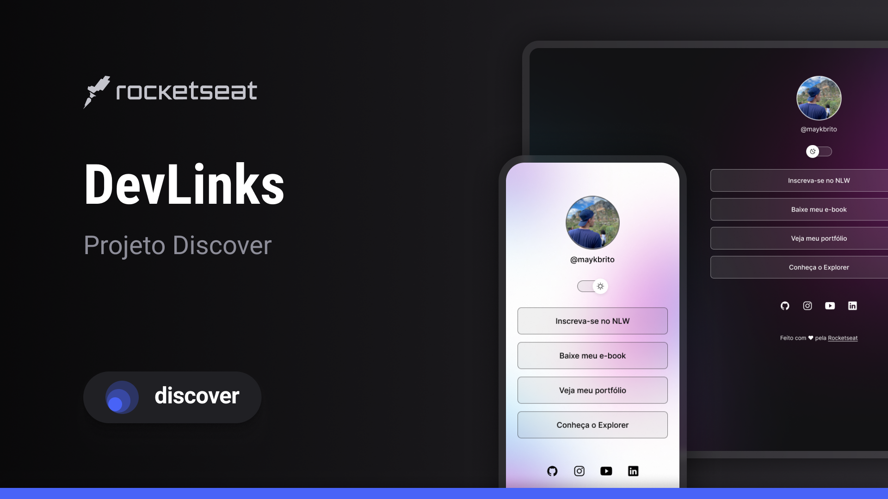

<h1 align="center">Projeto DevLinks </h1>

 Programa exclusivo e gratuito, promovido pela Rocketseat para ensino de tecnologias WEB

  <a href="#-tecnologias"> Tecnologias </a>&nbsp;&nbsp;&nbsp;|&nbsp;&nbsp;&nbsp;
  <a href="#-projeto"> Projeto </a>&nbsp;&nbsp;&nbsp;|&nbsp;&nbsp;&nbsp;
  <a href="#-layout"> Layout </a>&nbsp;&nbsp;&nbsp;|&nbsp;&nbsp;&nbsp;
  <a href="#-memo-licença"> Licença </a>&nbsp;&nbsp;&nbsp;|&nbsp;&nbsp;&nbsp;

  

  

## 🧑‍💻 Tecnologias

Esse projeto foi desenvolvido com as seguintes tecnologias:

- HTML e CSS
- JavaScript
- Git e GitHub
- Figma

## 📃 Projeto

O DevLink é um projeto que tem como objetivo criar links uteis para facilitar o acesso
de projetos pessoais e contribuições que eu possa ter feito. 

## 😄 Layout

Você pode visualizar o layout do projeto através [DESSE LINK](https://www.figma.com/design/Z4ZNPIeUCYBxHmo1tBxkGy/DevLinks-%E2%80%A2-Projeto-Discover-(Community)?node-id=10-620&t=mYaBMajW2qvRdkvE-0). É necessário ter conta no [Figma](https://figma.com) para acessá-lo.

## :memo: Licença

Esse projeto está sob a licença MIT.

---

Feito com ♥ by Ítalo César :wave: 
